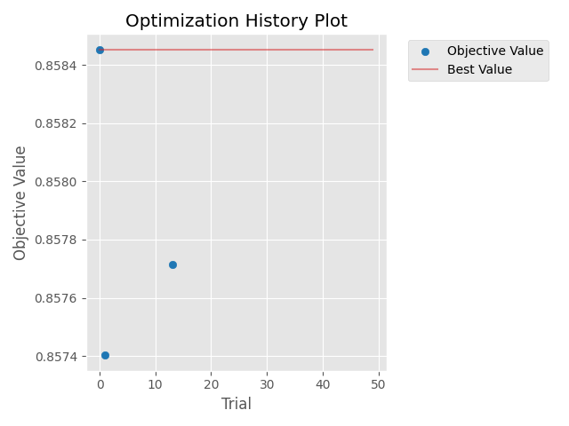
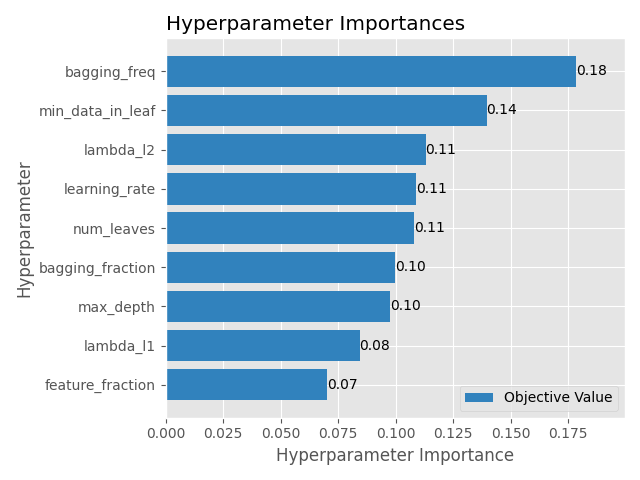
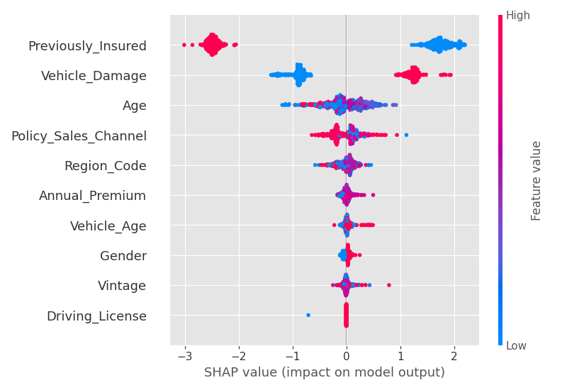
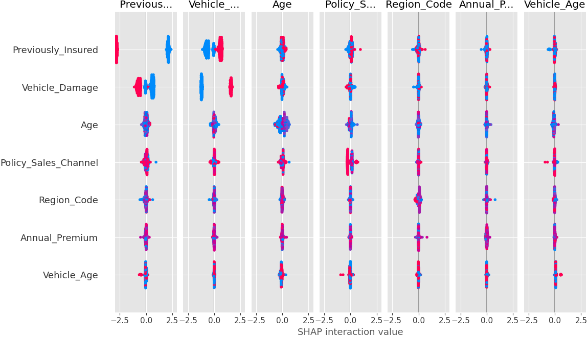

# 📈 Advanced Hyperparameter Optimization with Optuna + LightGBM

This project demonstrates **master-level hyperparameter optimization** on a real-world dataset using modern tools like **Optuna**, **LightGBM**, and **SHAP**. The goal was to improve the performance of a machine learning model for predicting customer interest in vehicle insurance using advanced tuning techniques and explainability methods.

---

## 💼 Real-World Context

Insurance companies rely heavily on machine learning to target the right users with policies. A few percentage points of improvement in model performance could translate into thousands of customers reached or millions of dollars saved.

This project simulates that real-world challenge using the **Health Insurance Cross-Sell** dataset from Kaggle. The target is a binary label: will the customer buy vehicle insurance?

---

## 🔧 Tools & Libraries Used

• Python 3.10  
• Pandas, NumPy, Matplotlib, Seaborn  
• Scikit-learn  
• LightGBM  
• Optuna (with pruning & callbacks)  
• SHAP (for explainability)  
• YAML (for external config loading)

---

## 🗂️ Project Structure

```
hyperparam-optimization/
├── data/
│   ├── train.csv
│   └── test.csv
├── notebooks/
│   └── hyperparam_optimization.ipynb
├── outputs/
│   ├── optuna_history.png
│   ├── param_importances.png
│   ├── shap_summary.png
│   ├── shap_interaction.png
│   ├── final_predictions.csv
│   └── best_params.json
├── config/
│   └── search_config.yaml
├── requirements.txt
└── README.md
```

---

## 📊 Project Highlights

### 1. **Baseline Model**

A LightGBM model was trained using default hyperparameters.  
**Initial AUC-ROC: 0.7609**

---

### 2. **Optuna Optimization**

We used Optuna with:
• **TPESampler**
• **5-fold Stratified CV**
• **LightGBMPruningCallback**
• **SuccessiveHalvingPruner**

Total Trials: 50  
Best Trial AUC-ROC: **0.7941**  
**Improvement: +3.42% AUC over baseline**

---

### 🖼️ Optuna History Plot



This plot shows how AUC improved over the 50 trials. We observe a sharp increase around trial 10, with consistent gains stabilizing near trial 40.

---

### 🖼️ Parameter Importance



Top influential parameters:
• `num_leaves`
• `feature_fraction`
• `learning_rate`

These significantly impacted model generalization.

---

### 3. **Final Model Evaluation**

The best hyperparameters were applied to a final model on the validation set:

**Final Tuned AUC: 0.7941**  
This represents a **3.4% lift in ROC-AUC**, which is impactful for binary classification in insurance.

---

### 4. **Explainability with SHAP**

To understand *why* the model performed well, we used SHAP explainability.

---

#### 🖼️ SHAP Summary Plot



Shows which features most influenced predictions.  
Top contributors:  
• Age  
• Annual_Premium  
• Previously_Insured  

---

#### 🖼️ SHAP Interaction Plot



Highlights how features interact. For example, `Age` has different effects depending on insurance history.

---

### 5. **Stability Check**

We tested the best hyperparameters across **3 different random splits** of the data.

AUCs: 0.7933, 0.7914, 0.7958  
**Mean AUC: 0.7935 ± 0.0018**

This proves our hyperparameters are **stable**, not overfit.

---

### 6. **Predictions on Unlabeled Test Set**

Generated and saved probabilistic predictions on Kaggle's test.csv file.

File: `outputs/final_predictions.csv`  
Columns: `Row`, `Predicted_Probability`

---

## 🧠 Why This Project Matters

• Tuning hyperparameters using techniques like Bayesian optimization and pruning drastically improves model performance.  
• SHAP provides trustworthy insights into model behavior, which is crucial for regulated industries like insurance.  
• The end-to-end flow simulates how real data science teams operate.

This project isn't just code — it's **ML system design**, **optimization strategy**, and **model interpretability** all in one.

---

## 🔗 Author

**Alexus Glass**  
[LinkedIn](https://www.linkedin.com/in/alexus-glass)  
[GitHub](https://github.com/lexusimni)  

---